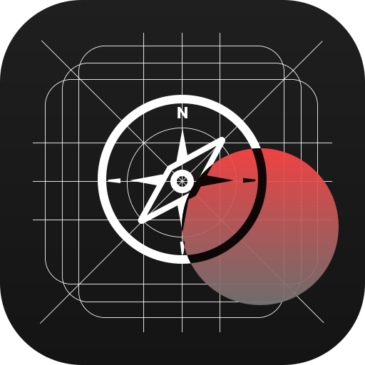

<div align="center">
<p align="center">
  <a href="https://asfs-web.com">
    
    <h3 align="center">React Native Expo Template</h3>
  </a>
  <p align="center">Modern, Scalable, Production-Ready</p>
</p>

[](https://expo.dev/)
[](https://reactnative.dev/)
[](https://www.typescriptlang.org/)
[](https://uniwind.dev/)

<p align="center">
  
  
  
  
</p>

<p align="center">
  A well-structured React Native template with <b>MVVM architecture</b>, <b>internationalization</b>, <b>auto-generated SVG icons</b>, and modern tooling out of the box.
</p>

---

[Features](#-features) •
[Quick Start](#-quick-start) •
[Project Structure](#-project-structure) •
[Icons](#-icons) •
[Localization](#-localization) •
[Scripts](#-scripts)

</div>

---

## ✨ Features

| Feature                     | Description                                                            |
| --------------------------- | ---------------------------------------------------------------------- |
| 🏗️ **MVVM Architecture**    | Clean separation with `model.ts`, `view.tsx`, `model-view.tsx` pattern |
| 🌍 **Internationalization** | Built-in i18next with EN, ES, RU locales                               |
| 🎨 **Auto SVG Icons**       | Drop SVG → run script → use as React components                        |
| 💅 **Uniwind**              | Tailwind CSS v4 bindings for React Native — `className` everywhere     |
| 📁 **Expo Router**          | File-based navigation with typed routes                                |
| 🔧 **ESLint + Prettier**    | Pre-configured linting with import sorting                             |
| 🐶 **Husky**                | Pre-commit hooks for code quality                                      |
| 📱 **New Architecture**     | React Native 0.81 with Fabric enabled                                  |

---

## 🚀 Quick Start

```bash
# Clone the template
git clone https://github.com/Aragam113/Expo-MVVM-Template.git my-app
cd my-app

# Install dependencies
npm install

# Start development
npx expo start
```

### Run on device

```bash
npm run android    # Android
npm run ios        # iOS
npm run web        # Web
```

---

## 📁 Project Structure

```
├── app/                      # Expo Router screens
│   ├── _layout.tsx           # Root layout (imports global.css)
│   └── (tabs)/               # Tab navigation
│       ├── _layout.tsx       # Tab bar configuration
│       ├── home/             # Home tab stack
│       ├── explore/          # Explore tab stack
│       └── icons/            # Icons demo tab
│
├── src/
│   ├── components/
│   │   └── icons/
│   │       └── svg-icons.tsx  # 🔄 Auto-generated icon components
│   │
│   ├── screens/              # MVVM screen modules
│   │   ├── base-model.ts     # Base props interface
│   │   ├── home/
│   │   │   ├── model.ts      # Types, constants, hooks
│   │   │   ├── view.tsx      # Pure UI component
│   │   │   └── model-view.tsx# Container with logic
│   │   ├── explore/
│   │   └── icons/
│   │
│   └── i18n/                 # Internationalization
│       ├── index.ts          # i18next configuration
│       └── locales/
│           ├── en-US/
│           ├── es-ES/
│           └── ru-RU/
│
├── assets/
│   ├── images/               # App icons, splash screen
│   └── svg-icons/            # 📥 Drop SVG files here
│
├── scripts/
│   ├── generate-icons.js     # SVG → React component generator
│   └── reset-project.js      # Reset to template state
│
├── global.css                # Tailwind v4 + Uniwind entry
└── metro.config.js           # Metro + withUniwindConfig
```

---

## 🎨 Icons

This template includes an **automatic SVG icon generation system**. No manual component creation needed!

> ⚠️ **Important:** Only simple, lightweight icons (UI icons, action icons) should be converted to React components via this system. Complex SVGs like illustrations, maps, brand logos, and flags are better served as static assets through `<Image source={require(...)} />` or `expo-image` — this enables caching and avoids bloating the JS bundle.

### Adding New Icons

<table>
<tr>
<td width="50%">

#### Step 1: Add SVG file

Drop your SVG file into `assets/svg-icons/`:

```
assets/
└── svg-icons/
    ├── HomeIcon.svg
    ├── SearchIcon.svg      ← new
    └── ProfileIcon.svg     ← new
```

</td>
<td width="50%">

#### Step 2: Generate components

Run the generator script:

```bash
npm run generate:icons
```

✅ Components auto-created in `src/components/icons/svg-icons.tsx`

</td>
</tr>
</table>

### Using Icons

```tsx
import { SearchIcon, ProfileIcon } from '@components/icons/svg-icons';

// Basic usage
<SearchIcon />

// With size (predefined)
<SearchIcon size="small" />   // 16px
<SearchIcon size="medium" />  // 24px (default)
<SearchIcon size="large" />   // 32px

// With custom size
<SearchIcon size={48} />

// With color
<SearchIcon color="#FF0000" />
<SearchIcon color={theme.colors.primary} />

// Combined props
<ProfileIcon size={32} color="#3B82F6" opacity={0.8} />
```

### Icon Props

| Prop      | Type                                             | Default    | Description                   |
| --------- | ------------------------------------------------ | ---------- | ----------------------------- |
| `size`    | `'small'` \| `'medium'` \| `'large'` \| `number` | `'medium'` | Icon size                     |
| `color`   | `string`                                         | —          | Override fill & stroke colors |
| `width`   | `number`                                         | —          | Custom width                  |
| `height`  | `number`                                         | —          | Custom height                 |
| `opacity` | `number`                                         | —          | Icon opacity                  |
| `style`   | `ViewStyle`                                      | —          | Additional styles             |

> 💡 **Tip:** Icon names are derived from filenames. `my-cool-icon.svg` → `MyCoolIcon`

---

## 🌍 Localization

Built-in internationalization with [i18next](https://www.i18next.com/) and [react-i18next](https://react.i18next.com/).

### Supported Languages

| Code | Language | Flag |
| ---- | -------- | ---- |
| `en` | English  | 🇬🇧   |
| `es` | Spanish  | 🇪🇸   |
| `ru` | Russian  | 🇷🇺   |

### Using Translations

```tsx
import { useTranslation } from 'react-i18next';

export const MyComponent = () => {
  const { t, i18n } = useTranslation();

  return (
    <View>
      {/* Simple translation */}
      <Text>{t('home-screen.welcome')}</Text>

      {/* Nested keys */}
      <Text>{t('icons-screen.step1')}</Text>

      {/* Change language */}
      <Button onPress={() => i18n.changeLanguage('es')}>Español</Button>

      {/* Current language */}
      <Text>Current: {i18n.language}</Text>
    </View>
  );
};
```

### Adding Translations

#### 1. Add to existing locale

Edit `src/i18n/locales/{locale}/translations.json`:

```json
{
  "home-screen": {
    "welcome": "Welcome!",
    "new-key": "New translation"
  },
  "my-feature": {
    "title": "Feature Title",
    "description": "Feature description"
  }
}
```

#### 2. Add new language

<details>
<summary>📝 Click to expand</summary>

1. Create new locale folder:

```
src/i18n/locales/
├── en-US/
├── es-ES/
├── ru-RU/
└── fr-FR/           ← new
    └── translations.json
```

2. Add translations:

```json
{
  "home-screen": {
    "welcome": "Bienvenue!"
  },
  "flag": "🇫🇷"
}
```

3. Register in `src/i18n/index.ts`:

```ts
import en from './locales/en-US/translations.json';
import es from './locales/es-ES/translations.json';
import ru from './locales/ru-RU/translations.json';
import fr from './locales/fr-FR/translations.json'; // ← add

const resources = {
  en: { translation: en },
  es: { translation: es },
  ru: { translation: ru },
  fr: { translation: fr }, // ← add
};
```

</details>

### Translation Keys Structure

```
translations.json
├── home-screen
│   ├── welcome
│   └── description
├── explore-screen
│   ├── label
│   ├── description
│   └── info
├── icons-screen
│   ├── label
│   ├── description
│   └── step1...step5
└── flag (emoji)
```

> 💡 **Fallback:** Missing translations automatically fall back to English (`fallbackLng: 'en'`)

---

## 🏗️ MVVM Architecture

Each screen follows the **Model-View-ModelView** pattern:

```
src/screens/home/
├── model.ts        # Types, interfaces, constants
├── view.tsx        # Pure presentational component
└── model-view.tsx  # Container with hooks & logic
```

### Pattern Example

<details>
<summary>📝 model.ts — Types & Interfaces</summary>

```ts
import { BaseScreenProps } from '@/screens/base-model';

export interface HomeScreenProps extends BaseScreenProps {
  onEnglishPress: () => void;
  onRussianPress: () => void;
  currentLanguage: string;
}

export const HOME_CONSTANTS = {
  HEADER_HEIGHT: 60,
};
```

</details>

<details>
<summary>🎨 view.tsx — Pure UI</summary>

```tsx
import { HomeScreenProps } from './model';

export const HomeScreenView = ({ insets, t, onEnglishPress, currentLanguage }: HomeScreenProps) => {
  return (
    <ScrollView className="flex-1 bg-[#141414]" contentContainerStyle={{ paddingTop: insets.top }}>
      <Text className="text-white text-lg">{t('home-screen.welcome')}</Text>
      <Pressable className="bg-zinc-700 rounded-md py-3 px-4 items-center" onPress={onEnglishPress}>
        <Text className="text-white">English</Text>
      </Pressable>
      <Text className="text-[#FFFFFFBB]">Current: {currentLanguage}</Text>
    </ScrollView>
  );
};
```

</details>

<details>
<summary>🔗 model-view.tsx — Container</summary>

```tsx
import { useTranslation } from 'react-i18next';
import { useSafeAreaInsets } from 'react-native-safe-area-context';
import { HomeScreenView } from './view';

export const HomeScreenContainer = () => {
  const insets = useSafeAreaInsets();
  const { t, i18n } = useTranslation();

  return (
    <HomeScreenView
      insets={insets}
      t={t}
      onEnglishPress={() => i18n.changeLanguage('en')}
      currentLanguage={i18n.language}
    />
  );
};
```

</details>

---

## 📜 Scripts

| Command                  | Description                        |
| ------------------------ | ---------------------------------- |
| `npm start`              | Start Expo development server      |
| `npm run android`        | Run on Android                     |
| `npm run ios`            | Run on iOS                         |
| `npm run web`            | Run on Web                         |
| `npm run generate:icons` | Generate icon components from SVGs |
| `npm run lint`           | Run ESLint                         |
| `npm run lint:fix`       | Fix ESLint errors                  |
| `npm run format`         | Format code with Prettier          |
| `npm run type-check`     | TypeScript type checking           |
| `npm run reset-project`  | Reset project to template state    |

---

## 🎨 Styling with Uniwind

Tailwind CSS v4 utility classes via [Uniwind](https://uniwind.dev/) — works on iOS, Android, and Web with the standard `className` prop.

```tsx
import { ScrollView, Text, View } from 'react-native';

<View className="flex-1 w-full bg-[#141414] p-4 gap-4 items-center">
  <Text className="text-white text-lg text-center">Hello</Text>
  <Text className="text-[#FFFFFFBB] text-xs">Subtitle</Text>
</View>;
```

Entry points:

- `global.css` — `@import 'tailwindcss'; @import 'uniwind';`
- `metro.config.js` — wrap config with `withUniwindConfig(...)`
- `app/_layout.tsx` — `import '../global.css'`

For dynamic style values (e.g. safe-area insets), keep them on the `style` / `contentContainerStyle` prop:

```tsx
<ScrollView
  className="flex-1 bg-[#141414]"
  contentContainerStyle={{ paddingTop: insets.top + 16 }}
/>
```

> Uniwind requires Tailwind **v4**. Theme tokens live in `global.css` via `@theme { ... }` — the legacy `tailwind.config.js` is not used.

---

## 📄 License

MIT © [Bubka Gop](https://github.com/Aragam113)

---

<div align="center">

**[⬆ Back to Top](#-react-native-expo-template)**

Made with ❤️ and ☕

</div>
